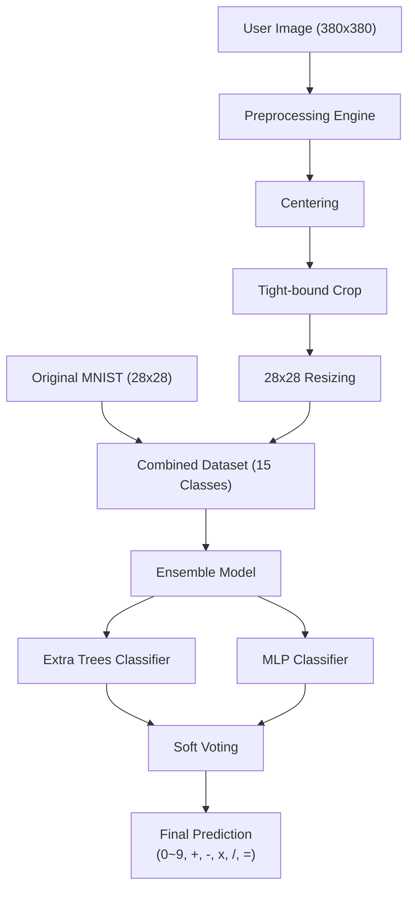

# ✍️ [ML] Hand-made & Original MNIST Dataset Comparison & Optimization
단순한 숫자 인식을 넘어 연산 기호를 포함한 15개 클래스에 대해,  
**최종 92.68%** 의 인식 정확도를 달성한 프로젝트입니다.
---
## 🏗 아키텍처 (Architecture)

---
## 📊 성능 지표 (Final Test Results)
15개 클래스(숫자+연산 기호)를 통합한 **Final Testset**에서 **Soft Voting Ensemble** 모델이 가장 우수한 성능을 기록했습니다.

| 테스트셋 (Testset) | 클래스 | Extra-Tree | MLP | Voting (soft) |
| :--- | :---: | :---: | :---: | :---: |
| **Final (Noised/Shifted)** | **15개** | 91.20% | 92.15% | **92.68%** |
| Team Testset | 10개 | 84.50% | 82.75% | 84.75% |
| Original MNIST | 10개 | 95.26% | 96.27% | 96.50% |

- 실생활에서 발생할 수 있는 **노이즈 및 위치 변형** 환경에서도 **92.68%**의 안정적인 인식률을 확보했습니다.
---
## 🛠 해결한 문제 (Problem Solving)
### 1. [데이터 신뢰성 회복: 전성 조사를 통한 라벨링 오류 정제]
- **문제**: 직접 수집한 데이터 중 약 2,000여 장에서 라벨링 오류가 발견되어 15개 클래스 학습의 정확도를 저해했습니다.
- **사고**: 자동 클리닝의 한계를 극복하기 위해 전수 조사를 통한 노이즈 필터링과 정제 과정을 결정했습니다.
- **해결**: 불량 데이터 2,119개를 직접 선별하여 제거함으로써, 복잡한 15종 분류 모델의 학습 안정성을 확보했습니다.
### 2. [도메인 격차 해소: 15개 클래스 통합 인식 성능 극대화]
- **문제**: 직접 쓴 연산 기호와 숫자는 규격화된 MNIST와 데이터 분포가 달라 통합 학습 시 성능이 급감했습니다.
- **사고**: 모델 최적화 이전에 데이터의 기하학적 정규화가 우선이라 판단하여 중심 맞춤(Centering) 파이프라인을 구축했습니다.
- **해결**: 전처리 파이프라인을 통해 도메인 격차를 해소했고, 최종 15종 혼합 데이터셋에서 **92.68%**의 성과를 거두었습니다.
---
## ✨ 주요 기능 (Key Features)
- **[15개 클래스 통합 인식]**: 숫자 10종과 연산 기호 5종(+, -, x, /, =)을 정밀하게 분류합니다.
- **[강력한 전처리 파이프라인]**: 노이즈 제거와 정규화를 포함하여 실전 이미지에 강한 자동화 엔진을 갖추었습니다.
- **[앙상블 분류 시스템]**: Extra Trees와 MLP의 결합을 통해 단일 모델보다 높은 신뢰도를 제공합니다.
---
## 🛠 기술 스택 (Tech Stack)
- **언어**: Python
- **라이브러리**: scikit-learn, NumPy, Pandas
- **이미지 처리**: OpenCV, Pillow (PIL)
- **시각화**: Matplotlib
---
## 💡 성장 및 향후 계획
- **배운 점**: 복잡한 15종 분류 작업에서도 데이터 정제와 전처리가 모델 성능에 핵심적인 역할을 함을 배웠습니다.
- **향후 계획**: 이 시스템을 바탕으로 실제 수식을 인식하고 계산하는 프로젝트로 확장해보고 싶습니다.
---
## 🛠 빌드 및 실행
1. `mnist_data.pkl`과 `Data/` 폴더에 데이터셋(`npz`) 파일을 배치해주세요.
2. 주피터 노트북에서 `최종1`부터 `최종5`번까지 순서대로 실행하시면 됩니다.
3. 최종 결과는 `최종5. Fine Tuning, Evaluation` 노트북에서 확인이 가능합니다.
